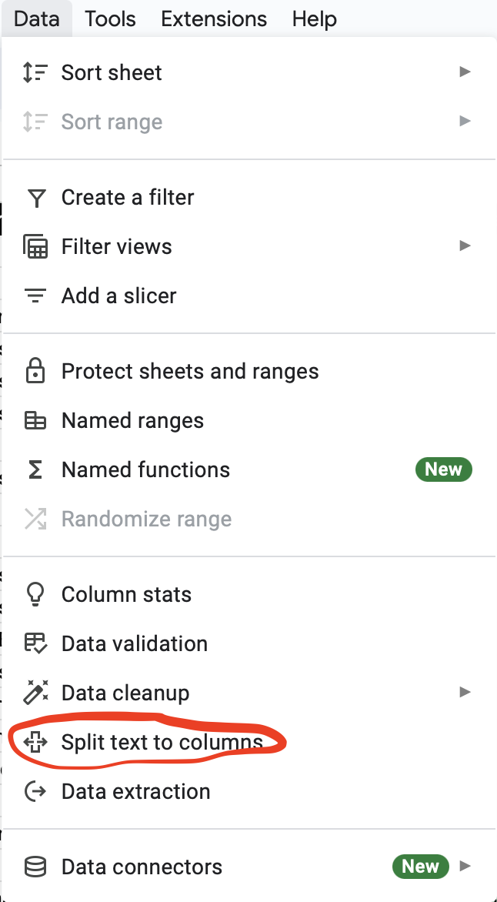

## fin-analyzer
Personal finances data parser and organizer for easy copy-paste into Google Sheets

### Install dependencies:
```
pip install numpy pandas
```

### As easy as 1, 2, 3:
1. Download the csv files from your checking, savings, and credit card account
2. Specify: 
    1. file path of each csv file, and the output file
    2. current balances of your checking, savings, and credit card accounts
    3. most recent transactions at the top or bottom of the sheet
3. Run the program (either as a notebook or python script) and copy and paste the output csv text into Google Sheets 

### Parse the data in Google Sheets:
<p align="center">
    
</p>
